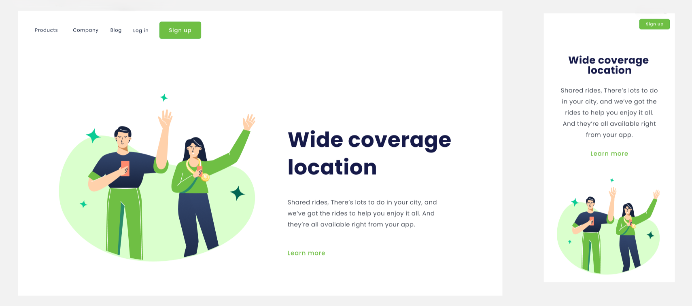

# Wide Coverage Location Landing Page

Este é um projeto de estudo criado para praticar HTML e CSS, com foco em design responsivo.

## Visão Geral do Projeto

## Descrição do Projeto

Esta landing page simula um serviço de compartilhamento de viagens, destacando a ampla cobertura de localizações. O projeto foi desenvolvido como parte de um exercício para aprimorar habilidades em desenvolvimento web front-end, especialmente em design responsivo.

## Características

- Design moderno e limpo
- Layout responsivo que se adapta a diferentes tamanhos de tela
- Menu de navegação simples
- Botão de inscrição
- Imagem ilustrativa principal
- Proposta de valor clara e concisa

## Tecnologias Utilizadas

- HTML5
- CSS3

## Aprendizados

Este projeto permitiu praticar:
- Estruturação de uma página web com HTML semântico
- Estilização usando CSS moderno
- Técnicas de design responsivo
- Posicionamento de elementos e layout flexível

## Como Visualizar

1. Clone este repositório:
